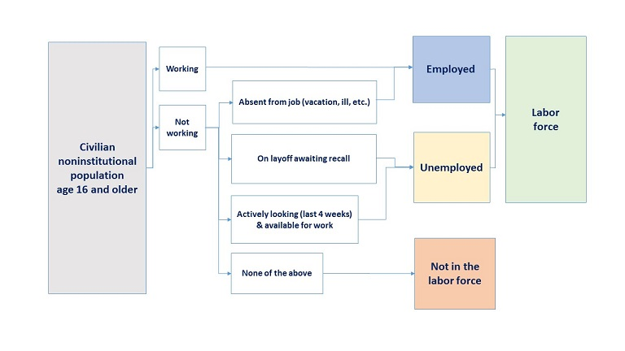

```{r setup, include=FALSE}
knitr::opts_chunk$set(echo = FALSE)
```

## Pandemic, Relief Package and Gig Workers

[Covid-19: Stringency Index](https://ourworldindata.org/grapher/covid-stringency-index?time=2020-12-19&region=NorthAmerica)

[Chip Shortage](https://fortune.com/2021/06/08/taiwan-covid-outbreak-chip-shortage-factory-supply/)

Question: How does Covid-related shutdown disrupt supply chain and macroeconomy?

[Google Mobility Trends](https://ourworldindata.org/covid-google-mobility-trends)

[Uber Driver's Unemployment Benefit](https://help.uber.com/driving-and-delivering/article/federal-unemployment-benefits-for-those-who-earn-with-uber?nodeId=d3f4d210-b7c8-42f0-97e0-b3c991aa0d07)

Question: Are Gig workers like Uber drivers counted as workers?

[Job Search Requirement and Unemployment Benefit](https://www.forbes.com/sites/sarahhansen/2021/05/17/at-least-36-states-are-reimposing-work-search-requirements-on-unemployment-benefits-recipients/?sh=2b7a0dc658f8)

Question: Are unemployed workers supposed to search job actively?

To answer these questions, we need basic concepts in macroeconomics.


## What is Macroeconomics?

When macroeconomists study an economy, they first look at three variables:

  - Output - the level of production of the economy as a whole - and its rate of growth.

  - Unemployment rate - the proportion of workers in the economy who are not employed and are looking for a job.
  
  - Inflation rate - the rate at which the average price of the goods in the economy is increasing over time.
  
## Output (GDP Definition 1)

Gross domestic product (GDP) is the value of the **final** goods and services produced in the economy during a given period.

Example:

  - [Texas Instrument](https://www.ti.com/applications/automotive/overview.html) produces chips (not edible), employing workers and using machines to do so. It sells the chips for \$100 to [Ford](https://media.ford.com/content/fordmedia/fna/us/en/news/2020/06/18/ford-co-pilot360-technology-adds-hands-free-driving.html), which produces cars. TI pays its workers \$80.
  
  - Ford buys the chip and uses it, together with workers and machines, to produce cars. Revenues from car sales are \$200. Of the \$200, \$100 goes to pay for chips and \$70 goes to workers in the firm, leaving \$30 in profit to the firm.
  

```{r, echo = FALSE, results = 'asis'}
library(knitr)
table1 = data.frame(matrix(c(100, 80, "-", 20, 200, 70, 100, 30), 4, 2)); rownames(table1) = c("Revenues from sales", "Wages", "chip purchases", "Profit"); colnames(table1) = c("TI (Chip Maker)", "Ford (car Manufacturer)")
knitr::kable(table1, caption = "Illustrate GDP definition 1")
```


Question: Would you define aggregate output in this economy as the sum of the values of all goods (\$100 from the production of chips and \$200 from the production of cars)? Or just the final goods (value of car \$200)?
  
## Output (GDP Definition 1)

Example (continued):

  - Suppose Texas Instrument is inspired by [Google self-driving car](https://waymo.com/) and [Tesla](https://www.tesla.com/autopilot), they decide to acquire Ford as a key procedure to enter self-driving market.
  
  - The acquisition lead to the merge of profit and loss statement (P&L). The merged firm sells cars for \$200, paying workers \$80 + \$70 = \$150, and making \$20 + \$30 = \$50 in profits.
  
```{r, echo = FALSE, results = 'asis'}
table2 = data.frame(matrix(c(200, 150, 50), 3, 1)); rownames(table2) = c("Revenues from sales", "Wages", "Profit"); colnames(table2) = c("TI&M (Merged Company)")
knitr::kable(table2, caption = "Illustrate GDP definition 1")
```

  - The **final** goods measure is still \$200. The **final** goods/service method is robust to get rid of double-counting on intermediate goods.

## Output (GDP Definition 2)

Gross domestic product (GDP) is the sum of *value added* in the economy during a given period. The value added by a firm is defined as the value of its production minus the value of the intermediate goods used in production.

  - In the two-firm example, Texas Instrument does not use intermediate goods. Its value added from TI is simply the value of chips it produces (\$100).
  
  - Ford uses chips as intermediate goods. So the value added from Ford is the cars it produces minus the chips it uses (\$200 - \$100 = \$100).
  
  - Total value added in the economy is \$100 + \$100 = \$200.
  
Example (continued)

```{r, echo = FALSE, results = 'asis'}
table1 = data.frame(matrix(c(100, 80, "-", 20, 200, 70, 100, 30), 4, 2)); rownames(table1) = c("Revenues from sales", "Wages", "chip purchases", "Profit"); colnames(table1) = c("TI (Chip Maker)", "Ford (car Manufacturer)")
knitr::kable(table1, caption = "Illustrate GDP definition 2")
```

Both definition 1 and definition 2 are GDP measured from **production side** (from producer's perspective).

## Output (GDP Definition 3)

Gross domestic product (GDP) is the sum of incomes in the economy during a given period.

Example (continued)

  - Of the \$100 of value added by TI, \$80 goes to workers (labor income), \$20 goes to firms (capital income).
  - Of the \$100 of value added by Ford, \$70 goes to labor income, \$30 goes to capital income.
  - For the whole economy, labor income is \$80 + \$70 = \$150, capital income is \$20 + \$30 = \$50.

```{r, echo = FALSE, results = 'asis'}
table1 = data.frame(matrix(c(100, 80, "-", 20, 200, 70, 100, 30), 4, 2)); rownames(table1) = c("Revenues from sales", "Wages", "chip purchases", "Profit"); colnames(table1) = c("TI (Chip Maker)", "Ford (car Manufacturer)")
knitr::kable(table1, caption = "Illustrate GDP definition 3")
```

**Total value of final goods and services == Total value added during the production == Total income earned by market participants.**

## Output (Nominal and real GDP)

**Nominal GDP** is the sum of the quantities of final goods produced mulitiplied by their current prices.

Nominal GDP increases over time for two reasons:

  - The production of most goods/services increases over time.
  - The prices of most goods/services increases over time.
  
Question: Does the increase of prices represent the increase of wellness? [Gas Price Charts](https://www.gasbuddy.com/charts) [Gas Price Map](https://www.gasbuddy.com/gaspricemap?lat=38.822395&lng=-96.591588&z=4)

To eliminate the effects of increasing prices on our GDP measure, we construct **real GDP** as the sum of the production of final goods multiplied by constant (rather than current) prices.

Example:

  - Suppose there is a gasoline producer, ExxonMobil in permian basin besides Ford and Texas Instrument in our economy.
  - Since Texas Instrument only produces intermediate goods (chips), we only consider cars produced by Ford and gas produced by ExxonMobil by "final goods" method in GDP measure.

## Output (Nominal and real GDP)

Example (continued):
  
```{r, echo = FALSE, results = 'asis'}
table1 = data.frame(matrix(c(2020, 2021, 10, 20, 20, 30, 10, 20, 1.5, 3), 2, 5)); colnames(table1) = c("Year", "Quantity (Cars)", "Price (cars)", "Quantity (Gas)", "Price (Gas)")
knitr::kable(table1, caption = "Illustrate nominal GDP vs real GDP")
```  

Nominal GDP:
$$
Y_{2020}^{n}=P_{2020}^{C}Q_{2020}^{C}+P_{2020}^{G}Q_{2020}^{G}=20\times10+1.5\times10=215\\
Y_{2021}^{n}=P_{2021}^{C}Q_{2021}^{C}+P_{2021}^{G}Q_{2021}^{G}=30\times20+3\times20=660
$$
From 2020 to 2021, nominal GDP has increased by $\frac{660-215}{215}\times100\% \approx 206.98\%$, due to both increasing production and increasing prices.

If we use 2020 as base year (prices of 2020 as constant price), Real GDP:
$$
Y_{2020}^{r}=Y_{2020}^{r}=215\\
Y_{2021}^{r}=P_{2020}^{C}Q_{2021}^{C}+P_{2020}^{G}Q_{2021}^{G}=20\times20+1.5\times20=430
$$
From 2020 to 2021, real GDP has increased by $\frac{430-215}{215}\times100\%=100\%$, only due to increasing production, keeping prices constant.

## Output (GDP Deflator and GDP Deflator Inflation)

The gap between nominal GDP and real GDP comes from price level, which can be measured by **GDP deflator**, the ratio of nominal to real GDP:
$$
P=\frac{Y^{n}}{Y^{r}}
$$
Since 2020 is base year, $P_{2020}=\frac{Y_{2020}^{n}}{Y_{2020}^{r}}=1$.

The GDP deflator for 2021 is $P_{2021}=\frac{Y_{2021}^{n}}{Y_{2021}^{r}}=\frac{660}{430}=153.49\%$.

Similarly, we define the gap between nominal GDP growth and real GDP growth as **GDP deflator inflation**, which is a measure of the increase in price level of goods produced in the economy during a given year, $Y_{t}$.

$$
\pi=\frac{Y_{t}^{n}-Y_{t-1}^{n}}{Y_{t-1}^{n}}-\frac{Y_{t}^{r}-Y_{t-1}^{r}}{Y_{t-1}^{r}}
$$

For 2021, $\pi_{2021}=\frac{Y_{2021}^{n}-Y_{2020}^{n}}{Y_{2020}^{n}}-\frac{Y_{2021}^{r}-Y_{2020}^{r}}{Y_{2020}^{r}}=206.98\%-100\%=106.98\%$

**GDP deflator inflation is NOT the growth of GDP deflator!** GDP deflator is to fill the gap between nominal and real GDP (level), GDP deflator inflation is to fill the gap between nominal growth and real growth rate of GDP.

## Unemployment (Measured by Unemployment Rate)

Employment (N) is the number of people who have a job; unemployment (U) is the number of people who **do not have a job** but **are looking for one**. The labor force (L) is the sum of employment and unemployment:

$$
L=N+U
$$
The unemployment rate (u) is the ratio of the number of people who are unemployed to the number of people in the labor force:
$$
u=\frac{U}{L}
$$
Note that only those looking for a job are counted as unemployed; those who do not have a job and are not looking for one are counted as **not in the labor force**. When unemployment is high, some of unemployed give up looking for a job, these people are no longer counted as unemployed, so called **discouraged workers**.

To take discouraged workers into consideration, we define *participation rate* as the ratio of labor force to the total population of working age. [Definition in CPS survey by Bureau of Labor Statistics](https://www.bls.gov/cps/definitions.htm)

## Unemployment (Definition in Practice)



The labor force participation rate represents the number of people in the labor force as a percentage of the civilian noninstitutional population age 16 and older. In other words, the participation rate is the percentage of the population that is either working or actively looking for work.

The labor force participation rate is calculated as: (Labor Force ÷ Civilian Noninstitutional Population age 16 and older) x 100%.
