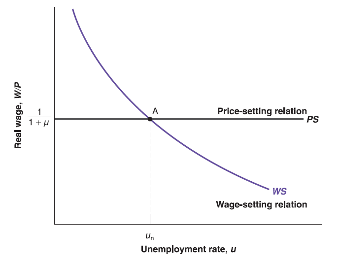

## Labor Market Equilibrium

The equilibrium solution is just on the intersection point of two curves.

The equilibrium unemployment rate ($u_{n}$) is so called **natural rate of unemployment**.

## An Increase in Unemployment Benefits

An increase in unemployment benefits can be represented by an increase in $z$, which appears in wage-setting relation: $\frac{W}{P}=F(u, z)$.

since the higher $z$, the higher real wage $\frac{W}{P}$. For any given unemployment rate $u$, workers require higher real wage $\frac{W}{P}$. The WS curve shifts up.
  

## An Increase in Unemployment Benefits

Put the PS curve on, the equilibrium real wage level $\frac{W}{P}\equiv\frac{1}{1+\mu}$ has no change since no change on $\mu$.

But the equilibrium unemployment rate (natural rate of unemployment $u_{n}$) will be higher.

The intuition is that: given higher unemployment benefit (higher $z$), for any real wage level $\frac{W}{P}$, unemployment always to be less painful, so that more workers prefer to be unemployed, equilibrium unemployment rate $u_{n}$ goes higher.

Question 1: How will the equilibrium shift if workers unionize to bargain for a higher real wage level?

Question 2: How if low-wage jobs are replaced by AI?

## A Less Stringent Enforcement of Antitrust Laws

[U.S. Antitrust Laws](https://www.ftc.gov/tips-advice/competition-guidance/guide-antitrust-laws)    &nbsp; &nbsp; &nbsp; &nbsp;  [T-Mobile/Sprint Merger](https://www.theverge.com/2021/5/11/22429587/t-mobile-sprint-merge-jobs-promise-pandemic)

Less stringent enforcement of antitrust law leads to greater market power of firms, higher economic profit, so that higher mark-up $\mu$ will be added on the top of cost.

Only price-setting relation $\frac{W}{P}=\frac{1}{1+\mu}$ includes $\mu$, The higher the mark-up $\mu$, the lower the real wage $\frac{W}{P}\equiv\frac{1}{1+\mu}$ for any unemployment rate $u$. So that PS curve shift down.

## A Less Stringent Enforcement of Antitrust Laws

Put the WS curve on. Since real wage $\frac{W}{P}$ goes down. 

Through the WS relation $\frac{W}{P}=F(u, z)$, the equilibrium unemployment rate (natural rate of unemployment $u_{n}$) goes up.

The intuition is that: 

  - Firms with higher market power can earn more economic profit (e.g. add higher mark-up $\mu$ on the top of cost when they sell goods). That means they offer lower real wage $\frac{W}{P}$ to their workers.

  - Lower real wages $\frac{W}{P}$ make more workers prefer to be unemployed, equilibrium unemployment rate $u_{n}$ goes higher.
  
Question: How if Amazon is split into several independent entities?  

[Jeff Bezos's Thanks vs. Refund](https://www.foxnews.com/media/jeff-bezos-panned-for-thanking-amazon-employees-customers-for-paying-for-spaceflight-id-like-a-refund)

