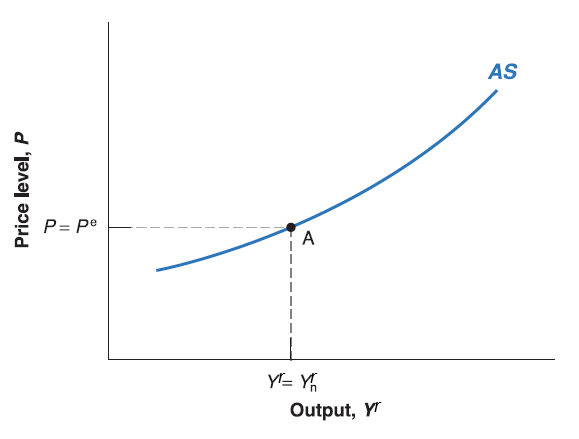

## Inflation and Expected Price Level

Recall labor market condition:

$$
\begin{cases}
W=P\cdot F(u, z)           & \text{wage-setting relation}  \\
P=(1+\mu)W   & \text{price-setting relation}
\end{cases}
$$
The solution is that: equilibrium real wage $\frac{W}{P}=\frac{1}{1+\mu}$ and equilibrium unemployment rate (natural rate of unemployment $u_{n}$) satisfies $\frac{1}{1+\mu}=F(u_{n}, z)$.

  - Note that this solution is nothing related to nominal variable: nominal wage $W$ or price $P$.
  
  - Instead, it tells us the equilibrium level of the ratio between those two variables: real wage $\frac{W}{P}$ is fixed given $\mu$.
  
  - In other words, it tells us nominal wage $W$ grows as fast as price level $P$ on labor market equilibrium.
  
## Inflation and Expected Price Level
  
However, there is always an intertemporal decision making process in real life:

  - Workers get nominal wages $W$ in this period, but spend their wages to cover their living cost in next period. No one knows the aggregate price level in next period, so the evaluation on real wage is actually based on workers expectation on future price level (expected price level $P^{e}$).
  
  - Now wage-setting relation can be modified as $W=P^{e}\cdot F(u, z)$. The higher the expected price level $P^{e}$, the higher nominal wage $W$ workers require.
  
  - Firms sell goods at current price level $P$, and pay nominal wage $W$. so there is no change on price-setting relation $P=(1+\mu)W$.
  
The modified version of labor market condition as follow:

$$
\begin{cases}
W=P^{e}\cdot F(u, z)           & \text{wage-setting relation}  \\
P=(1+\mu)W   & \text{price-setting relation}
\end{cases}
$$

## Inflation and Expected Price Level

This modified labor market condition is more general:

  - Workers do not necessarily predict future price level correctly. The expected price level ($P^{e}$), the realized future price level (we can denote it as $P'$) and the current price level ($P$) may be different from each other.
  
  - The previous version of labor market equilibrium is a special case: workers' expectation is correct and price level won't change in the future (e.g. $P^{e}=P'=P$), and also equilibrium unemployment rate is natural rate of unemployment $u_{n}$ satisfies $\frac{1}{1+\mu}=F(u_{n}, z)$.
  
Now since expected price level ($P^{e}$) is given by workers' expectation (exogenous), wage-setting relation $W=P^{e}\cdot F(u, z)$ no longer depends on current price level $P$.

To simplify our analysis, plug wage-setting relation $W=P^{e}\cdot F(u, z)$ into price-setting relation $P=(1+\mu)W$:

$$
P=P^{e}\cdot (1+\mu)F(u, z)
$$

It looks nice since we phased out labor market specific variable: nominal wage ($W$). But there is still another labor market specific variable: unemployment rate ($u$). If we can substitute out $u$ by some way, that would be even better!

## Employment and Output

Recall definition of unemployment rate: $u=\frac{U}{L}=\frac{L-N}{L}=1-\frac{N}{L}$

  - where $U$ denote unemployment, $N$ denote employment and $L$ the labor force.
  
Rearranging it, we have: $N=L(1-u)$.

Recall simplified production function $Y^{r}=N$.

  - Obviously the output in production function is real output (real GDP), to make it clear, we denoted as $Y^{r}$.

Now we do reverse engineering, $u=1-\frac{N}{L}=1-\frac{Y^{r}}{L}$ and plug into our price-unemployment equation:$P=P^{e}\cdot (1+\mu)F(u, z)$:
$$
P\equiv P^{e}(1+\mu)F(1-\frac{Y^{r}}{L},z)
$$
  - It implies that: we don't necessarily deal with natural unemployment rate ($u$) directly; Instead, we have some relation between current price level ($P$) and output level ($Y^{r}$). 

## Aggregate Supply

  - Now expected price level ($P^{e}$) is given by workers' expectation; mark-up ($\mu$) is given by goods market competition; labor force ($L$) is given by work-leisure trade-off of labor participants; $z$ is given catchall variable. All of them are exogenous variables (given outside of the model).
  
  - Only two variables are endogenous (determined inside the model): current price ($P$) and output ($Y^{r}$)
  
  - Maybe we can draw some graph about price-output (quantity) similar to supply curve in microeconomics! [BINGO!!!](tenor.gif)
  
  - This curve derived from production function and labor market condition, it characterizes the supply side of macro-economy, we call it **aggregate supply curve (AS)**.
  
  - The higher the real output ($Y^{r}$), the lower the unemployment rate $1-\frac{Y^{r}}{L}$. Since $F(\cdot)$ is decreasing function on unemployment rate $u=1-\frac{Y^{r}}{L}$, current price level ($P$) goes higher (Upward-sloping curve if $P$ is on vertical axis and $Y^{r}$ on horizontal axis).

## Natural Employment and Natural Output
  
Now plug the equilibrium unemployment rate (natural rate of unemployment) in: $N_{n}=L(1-u_{n})$.

  - **Natural level of employment** $N_{n}$ is equal to labor force $L$ times natural rate of employment (e.g. 1 minus natural rate of unemployment $u_{n}$).

Recall simplified production function $Y^{r}=N$. Plug natural employment $N_{n}$ in, we get $Y_{n}^{r}=N_{n}$.

  - Here $Y_{n}$ is the output level corresponding to natural rate of unemployment $u_{n}$, we call it **natural output**.
  
Since on labor market equilibrium:

  - Workers' expectation is correct and price level won't change in the future (e.g. $P^{e}=P'=P$).
  
  - Equilibrium unemployment rate is natural rate of unemployment $u_{n}$, so that output on natural output level $Y^{r}=Y_{n}^{r}$.
  
The Aggregate Supply (AS) curve goes through labor market equilibrium point where $P=P^{e}$ and $Y^{r}=Y_{n}^{r}$.
  
## Aggregate Supply
  

  
  - When output ($Y'^{r}$) goes above the natural output level ($Y_{n}^{r}$),  the price level ($P'$) would be higher than expected price level ($P^{e}$).
  
  - When output ($Y'^{r}$) goes below the natural output level ($Y_{n}^{r}$),  the price level ($P'$) would be lower than expected price level ($P^{e}$).

## Aggregate Supply

  - An increase in expected price level ($P^{e}$), shift the aggregate supply (AS) curve up.

  - A decrease in expected price level ($P^{e}$), shift the aggregate supply (AS) curve down.