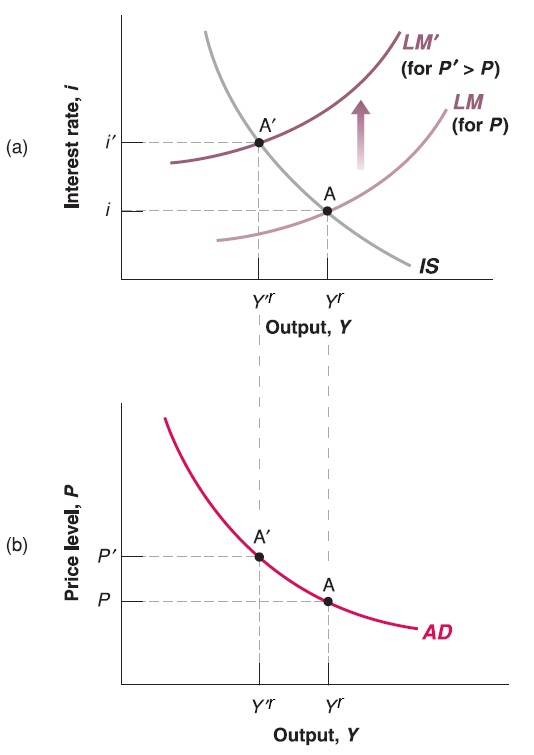
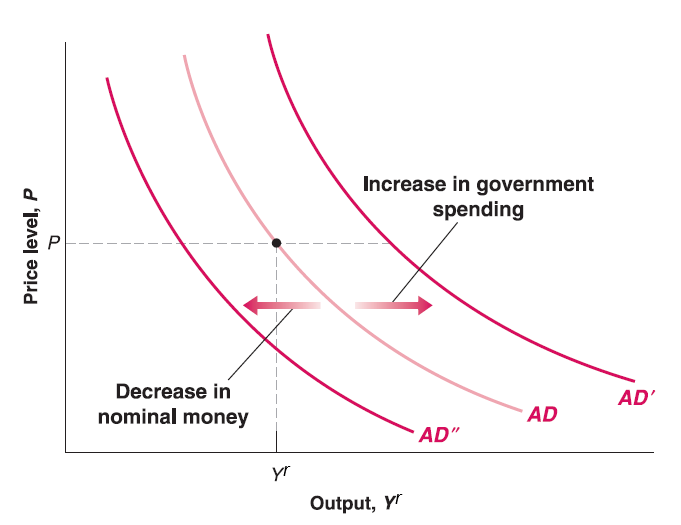

## Aggregate Demand

Recall the policy change effect in IS-LM model, the framework mostly focus on demand side analysis. It enlightens us that we may derive some form of Aggregate Demand (AD) curve from IS-LM model:

$$
\begin{cases}
(1 - c_{1})Y^{r} = c_{0}-c_{1}T+I(i)+G & \text{IS relation}\\
\frac{M}{P}=Y^{r}\cdot L(i) & \text{LM relation}
\end{cases}
$$
Since we've already got Aggregate Supply (AS) curve on price $P$ and output $Y^{r}$. Now our goal is to make an Aggregate Demand (AD) curve on price $P$ and output $Y^{r}$ to put on the graph.

  - In IS-LM model, we assume price level $P$ is given and unchanged in the short run. Here we can simply relax our assumption to endogenize price $P$ (e.g. price $P$ determined inside the model).

  - Output $Y^{r}$ has already there as an endogenous variable (determined inside the model), which is good.
  
  - There is another endogenous variable: interest rate $i$, we need to find some way to substitute it away!
  
## Aggregate Demand

*(Not required)* One way to git rid of $i$ is to do hardcore mathematical substitution:
Rearrange IS relation:
$$
I(i) = (1 - c_{1})Y^{r}+c_{1}T-c_{0}-G
$$
Solving $i$ by taking inverse function of $I(\cdot)$:
$$
i = I^{-1}((1 - c_{1})Y^{r}+c_{1}T-c_{0}-G)
$$
Plug it into LM relation:
$$
\frac{M}{P}=Y^{r}\cdot L(I^{-1}((1 - c_{1})Y^{r}+c_{1}T-c_{0}-G))
$$

  - The higher the $Y^{r}$, the higher the $(1 - c_{1})Y^{r}+c_{1}T-c_{0}-G$ since $1 - c_{1}>0$ (marginal propensity to consume $c_{1}<1$).
  
  - Since $I(\cdot)$ is decreasing function, its inverse function $I^{-1}(\cdot)$ is decreasing function too. The higher the $(1 - c_{1})Y^{r}+c_{1}T-c_{0}-G$, the lower the $I^{-1}((1 - c_{1})Y^{r}+c_{1}T-c_{0}-G)$.
  
  - Since $L(\cdot)$ is decreasing function, the lower the $I^{-1}((1 - c_{1})Y^{r}+c_{1}T-c_{0}-G)$, the higher the $L(I^{-1}((1 - c_{1})Y^{r}+c_{1}T-c_{0}-G))$.

## Aggregate Demand
  
In summary, the higher $Y^{r}$, the higher the right hand side of equation since both $Y^{r}$ and $L(I^{-1}((1 - c_{1})Y^{r}+c_{1}T-c_{0}-G))$ go higher. To hold the equality, price $P$ should be lower since nominal money supply $M$ is given.

  - In short, the higher output $Y^{r}$, the lower price level $P$ (downward-sloping curve for the relation between price $P$ and output $Y^{r}$)! Looks nice and similar to the shape of demand curve in Microeconomics! [BINGO!!!](bingo.gif)
  
**(Required)** Another way to derive the Aggregate Demand (AD) curve is more intuitive:

  - Plot IS-LM model.
  
  - Change the price level $P$. Note that in the graph of IS-LM model, the vertical axis is (endogenous variable) interest rate $i$, not price $P$! Price $P$ is still exogenous variable here. So the change of price level $P$ should shift LM curve!
  
  - See what's happening on output $Y^{r}$, this is the way to map the relationship of price $P$ and output $Y^{r}$ on a graph with vertical axis $P$ and horizontal axis $Y^{r}$.
  
This curve called **Aggregate Demand** (AD) curve since it comes from demand side ajustment in IS-LM model.

## Aggregate Demand

## Aggregate Demand

- The higher the price level (from $P$ to $P'$), the lower the output (from $Y^{r}$ to $Y'^{r}$).

The intuition goes into IS-LM model:

  - According to LM relation: $M=P\cdot Y^{r}\cdot L(i)$. Given nominal money supply $M$ unchanged, the higher the price level $P$, the lower the amount of goods consumers can afford. So that demand of goods output $Y^{r}$ goes down (income $Y^{r}$ goes down). Also, consumers have less extra money to buy bonds, so bond issuers have to increase interest rate $i$ to attract buyers.

  - In short, the higher price level $P$, the lower output (income $Y^{r}$).
  
## Aggregate Demand

