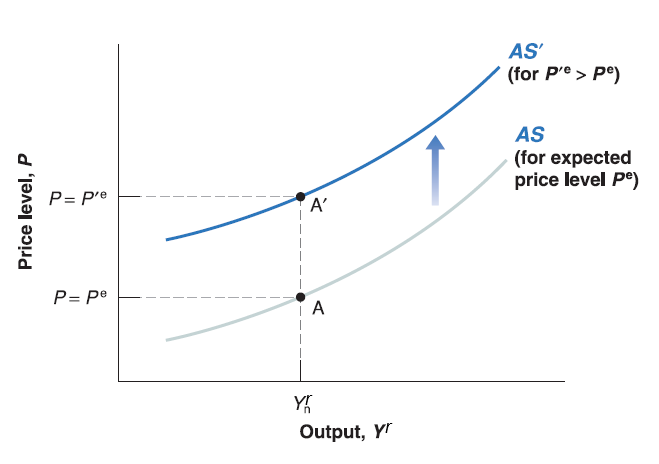
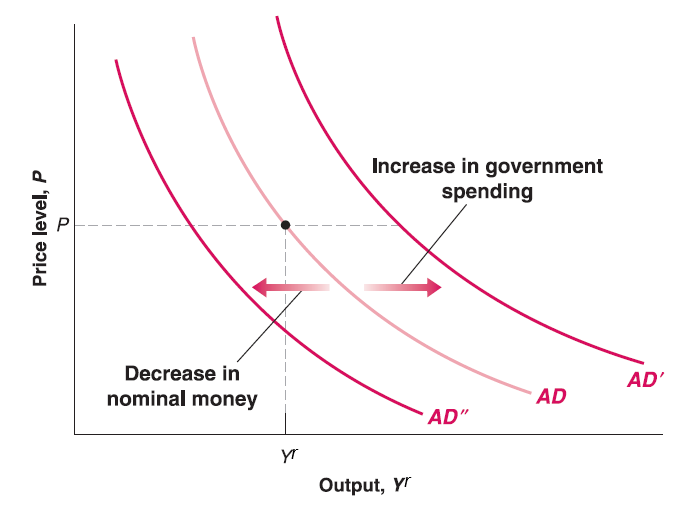
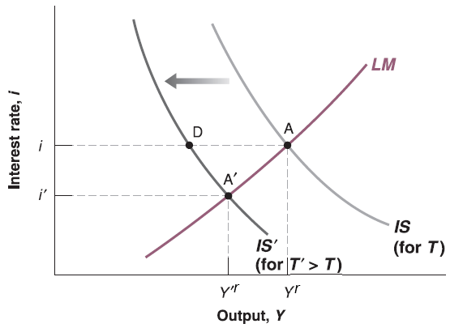
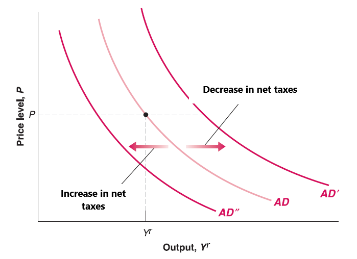
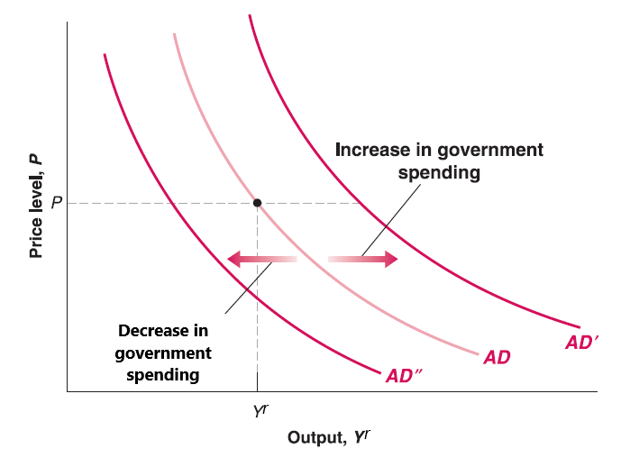
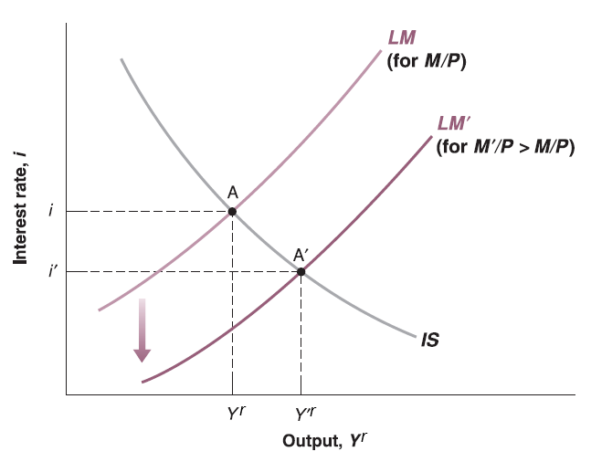
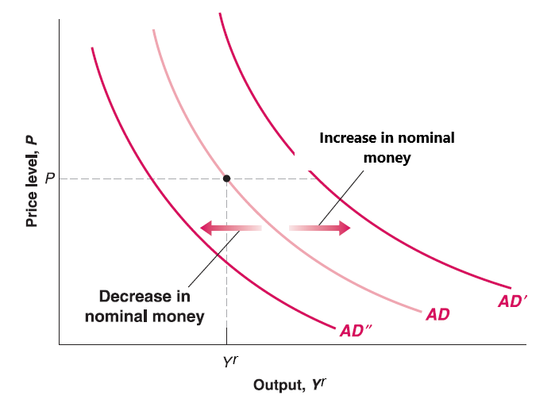

## Aggregate Supply Curve

Recall the Aggregate Supply (AS) curve we derived:$P\equiv P^{e}(1+\mu)F(1-\frac{Y^{r}}{L},z)$

  - Now expected price level ($P^{e}$) is given by workers' expectation; mark-up ($\mu$) is given by goods market competition; labor force ($L$) is given by work-leisure trade-off of labor participants; $z$ is given catchall variable. All of them are exogenous variables (given outside of the model).
  
  - Only two variables are endogenous (determined inside the model): current price ($P$) and output ($Y^{r}$).
  
Question 1: How does AS curve shift if mark-up ($\mu$) increases?

Question 2: How does AS curve shift if catchall variable ($z$) increases?

## Aggregate Demand Curve

Recall the Aggregate Demand (AD) curve we derived: $\frac{M}{P}=Y^{r}\cdot L(I^{-1}((1 - c_{1})Y^{r}+c_{1}T-c_{0}-G))$

  - Now nominal money supply ($M$) is given by central bank; autonomous consumption ($c_{0}$) and marginal propensity to consume ($c_{1}$) is given by consumers' preference; net taxes ($T$) and government spending ($G$) are given by government. Functions $L(\cdot)$ and $I^{-1}(\cdot)$ are given as well.
  
  - Only two variables are endogenous (determined inside the model): current price ($P$) and output ($Y^{r}$).

## Aggregate Demand Curve

Recall our IS-LM model:
$$
\begin{cases}
(1 - c_{1})Y^{r} = c_{0}-c_{1}T+I(i)+G & \text{IS relation}\\
\frac{M}{P}=Y^{r}\cdot L(i) & \text{LM relation}\
\end{cases}
$$

  - Assume price ($P$) unchanged, the increase of net taxes ($T$) leads to decrease in output ($Y^{r}$) and interest rate ($i$).
  
## Aggregate Demand Curve
  
  - Since Aggregate Demand (AD) curve comes from IS-LM model, for any price level ($P$), the increase of net taxes ($T$) leads to decrease in output ($Y^{r}$).
  
Question 1: How does AD curve shift if net taxes ($T$) increases?

Question 2: How does AD curve shift if net taxes ($T$) decreases?

## Aggregate Demand Curve

In your midterm project, you've seen that by IS-LM model

  - Assume price ($P$) unchanged, the increase of government spending ($G$) leads to increase in output ($Y^{r}$) and interest rate ($i$).
  
  - Since Aggregate Demand (AD) curve comes from IS-LM model, for any price level ($P$), the increase of net taxes ($G$) leads to increase in output ($Y^{r}$).
  

## Aggregate Demand Curve

  - Assume price ($P$) unchanged, the increase of nominal money supply ($M$) leads to increase in output ($Y^{r}$) and decrease in interest rate ($i$).
  
  - Since Aggregate Demand (AD) curve comes from IS-LM model, for any price level ($P$), the increase of nominal money supply ($M$) leads to increase in output ($Y^{r}$).

## Aggregate Demand Curve
  
Question 1: How does AD curve shift if nominal money supply ($M$) increases?

Question 2: How does AD curve shift if nominal money supply ($M$) decreases?

