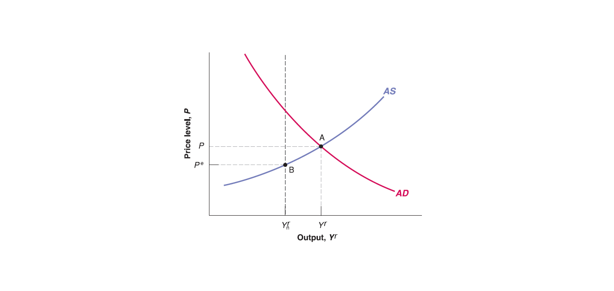
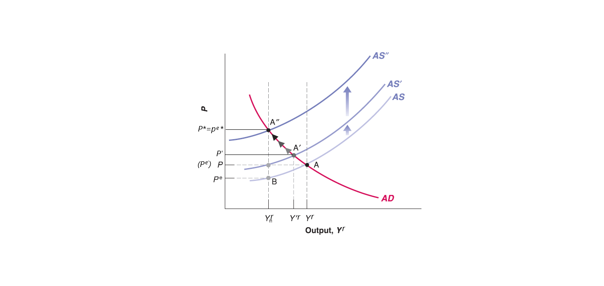

## AS-AD Model in Short Run

Now let's put Aggregate Supply (AS) curve and Aggregate Demand (AD) curve together:
$$
\begin{cases}
P= P^{e}(1+\mu)F(1-\frac{Y^{r}}{L},z) & \text{AS curve}\\
\frac{M}{P}=Y^{r}\cdot L(I^{-1}((1 - c_{1})Y^{r}+c_{1}T-c_{0}-G)) & \text{AD curve}
\end{cases}
$$

## AS-AD Model in Short Run

Now we have a two-equation two-unknown (endogenous variable) system, which is called: **AS-AD model**.

- There are several exogenous variables (given outside the model):

    - Expected price level ($P^{e}$) given by workers' expectation, mark-up $\mu$ given by goods market competition, labor force $L$ given by labor participants' preference, labor market catchall variable $z$ is given, function $F(\cdot)$ is given as well.
    
    - Nominal money supply ($M$) given by central bank, autonomous consumption $c_{0}$ and marginal propensity to consume $c_{1}$ are given by consumers' preference, net taxes ($T$) and government spending ($G$) are given by government, functions $L(\cdot)$ and $I^{-1}(\cdot)$ are given as well.
    
- Only two endogenous variables (determined inside the model): price level ($P$) and output level ($Y^{r}$).

For Aggregate Supply (AS) curve, there is a special case - labor market equilibrium - where:

  - where expected price ($P^{e}$), current price ($P$) and future price ($P'$) are equal to each other (e.g. $P^{e}=P=P'$). So no further adjustment on price level, price level keep stable (unchanged).
  
  - the labor market equilibrium unemployment rate is natural rate of unemployment ($u_{n}$), the corresponding output level is natural output $Y_{n}^{r}$.
  
## AS-AD Model in Short Run
  
Thus, Aggregate Supply (AS) curve always passes through the labor market equilibrium point. However, labor market equilibrium may not hold in short run:

  - When output ($Y'^{r}$) goes above the natural output level ($Y_{n}^{r}$),  the price level ($P'$) would be higher than expected price level ($P^{e}$).
  
  - When output ($Y'^{r}$) goes below the natural output level ($Y_{n}^{r}$),  the price level ($P'$) would be lower than expected price level ($P^{e}$).
  
The solution of AS-AD model is the goods market and financial market equilibrium:

  - Goods market equilibrium always satisfies aggregate supply equals to aggregate demand. That means goods market equilibrium is on the intersection point of AS curve and AD curve.
  
  - Since AD curve is derived from IS-LM model, every point on AD curve satisfies financial market equilibrium along with goods market equilibrium.
  
Thus, The intersection point of AS curve and AD curve satisfies both goods market equilibrium and financial market equilibrium simultaneously. 

## AS-AD Model in Medium Run

However, it doesn't necessarily satisfy labor market equilibrium, since expected price level ($P^{e}$) can be different from current price level ($P$) and future price level ($P'$) in short run.

  - It takes some time for workers to update their expected price level ($P^{e}$), renew labor contract (adjust nominal wages $W$).
  
Workers will keep adjusting their expected price level ($P^{e}$) until it reaches labor market equilibrium where expected price level equal to current price level and future price level (e.g. no more change on price) and unemployment rate on natural rate of unemployment ($u_{n}$), output on natural output ($Y_{n}^{r}$).

  - Eventually, the economy will reach labor market equilibrium along with goods market and financial market equilibrium in medium run. So that in medium run, equilibrium output level is always natural output level $Y_{n}^{r}$, equilibrium price level $P^*$ equals to expected price level ($P^{e*}$) and no more change on price level (future price level keeps on equilibrium price level).
  
Mathematically, it's easy to show that the natural output $Y_{n}^{r}$ is the same level as long as expected price level equals price level ($P^{e}=P$), no matter which price level it is at.

Recall Aggregate Supply curve: $P= P^{e}(1+\mu)F(1-\frac{Y^{r}}{L},z)$

When $P^{e}=P$, then $P^{e}$ and $P$ cancel out: $1= 1(1+\mu)F(1-\frac{Y_{n}^{r}}{L},z)$.

No matter what the number of $P^{e}$ and $P$ is, the natural output $Y_{n}^{r}$ is the same as long as $P^{e}=P$.

## AS-AD Model from Short Run to Medium Run

  - In short run, Aggregate Supply curve passes through labor market equilibrium point $B$, where expected price level is $P^{e}$ and natural output level is $Y_{n}^{r}$.
  
## AS-AD Model from Short Run to Medium Run

  - However, the intersection point of AS curve and AD curve is $A$, which means equilibrium output level is $Y^{r}$ and equilibrium price level is $P$ on goods market equilibrium (as well as financial market equilibrium by AD curve).

  - Workers see the realized price level $P$ is higher than their expectation $P^{e}$. To cover the increasing living cost, they update their expected price level to $P^{e'}=P$ and renegotiate labor contract (require higher wage). Since expected price level is exogenous variable given by workers' expectation, the increase of expected price level (from $P^{e}$ to $P^{e'}$) will shift Aggregate Supply curve up to AS'.
  
  - Now new Aggregate Supply curve (AS') passes through new labor market equilibrium point (expected price level $P^{e'}=P$ and natural output level $Y_{n}^{r}$). However, the new goods market equilibrium $A'$ has new equilibrium output level $Y'^{r}$ and new realized equilibrium price $P'$. The realized price $P'$ is still higher than expected price level $P^{e'}=P$.
  
  - Workers see higher realized price level $P'$ and keep adjusting their expected price level, so Aggregate Supply curve keeps shifting up.
  
  - Until Aggregate Supply curve reaches some AS'', where the goods market and financial market equilibrium reach natural output level $Y_{n}^{r}$. So that by labor market condition (See AS equation), expected price level equals current price level ($P^{e*}=P^{*}$) and no more change on price level (future price level keeps on $P^*$).

**In short run, manipulate demand side may boost output (real GDP) level for a while. However, price and wage adjustment will push output level back to natural output level, with a higher price tag!** [See Stagflation (Wage-Price Spiral) in 1970s](https://kansaspublicradio.org/npr-news/think-inflation-bad-now-lets-take-step-back-1970s)

