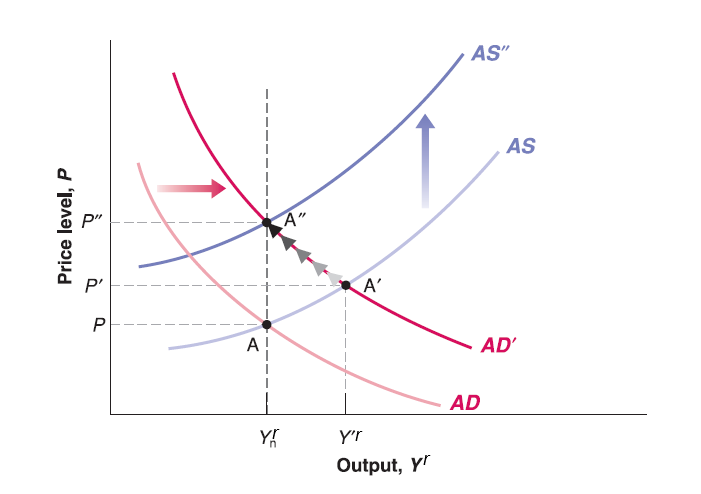
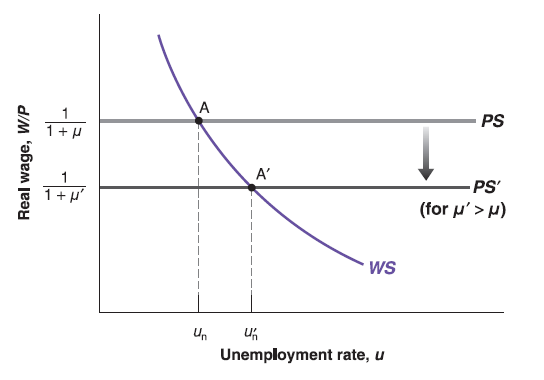
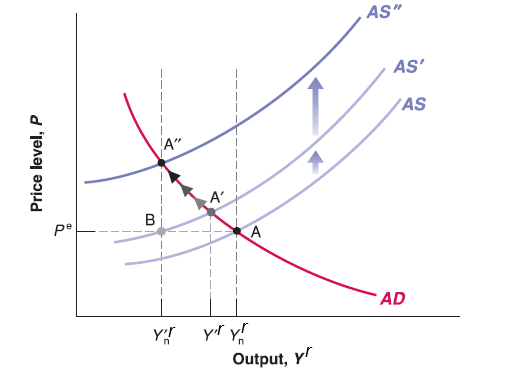

## Monetary Policy in Medium Run on AS-AD Model (Monetary Expansion)

Recall previous lectures:

  - In short run IS-LM model, we said increase of money supply (monetary expansion) will shift LM curve down.
  
  - Since Aggregate demand curve derived from IS-LM model, increase of money supply (monetary expansion) will shift AD curve to the right.
  
## Monetary Policy in Medium Run on AS-AD Model (Monetary Expansion)
  
Assume the economy starts on medium run equilibrium (labor market equilibrium, goods market equilibrium and financial market equilibrium hold simultaneously, expected price level equals to current price level and keep unchanged ($P^{e}=P$), Output level on natural output level ($Y_{n}^{r}$):

  - Now central bank implements monetary expansion policy (increase of money supply).
  
  - In short run, this will push AD curve to right, goods market and financial market equilibrium deviate labor market equilibrium. Price level goes higher than expected price level ($P'>P=P^{e}$), output level higher than natural output level ($Y'^{r}>Y_{n}^{r}$).
  
  - In medium run, workers will upwardly update expected price level ($P^{e}$), this will shift AS curve up. Until the output goes back to natural output level ($Y_{n}^{r}$) and expected price level equal to current price level again. So that labor market equilibrium restores. The economy reaches new medium run equilibrium but equilibrium price level hikes.

Question: How if central bank implements monetary contraction policy (reduces money supply)?

## Effects on Natural Rate of Unemployment on Labor Market Equilibrium

  - Less stringent enforcement of antitrust law leads to greater market power of firms, higher economic profit, so that higher mark-up $\mu$ will be added on the top of cost.
  
  - Only price-setting relation $\frac{W}{P}=\frac{1}{1+\mu}$ includes $\mu$, The higher the mark-up $\mu$, the lower the real wage $\frac{W}{P}\equiv\frac{1}{1+\mu}$ for any unemployment rate $u$. So that PS curve shift down.
  
  - The labor market equilibrium unemployment rate (natural rate of unemployment) $u_{n}$ goes up since no change on wage-setting relation $\frac{W}{P}=F(u, z)$.

## Effects on Natural Rate of Unemployment on Labor Market Equilibrium

  - An increase in unemployment benefits (e.g. increase $z$), which appears in wage-setting relation: $\frac{W}{P}=F(u, z)$. The WS curve shifts up.
  
  - Price-setting equation $\frac{W}{P}\equiv\frac{1}{1+\mu}$ has no change. But the equilibrium unemployment rate (natural rate of unemployment $u_{n}$) will be higher.

## Effects on Natural Rate of Unemployment on AS-AD Model

In summary, higher mark-up $\mu$ or higher catchall variable $z$ will increase natural rate of unemployment.

  - Recall the definition of natural rate of unemployment: $u_{n}=1-\frac{N_{n}}{L}=1-\frac{Y_{n}^{r}}{L}$, the increase of natural rate of unemployment $u_{n}$ means decrease of natural output level $Y_{n}^{r}$.

  - Since Aggregate Supply (AS) curve passes through labor market equilibrium point. For given $P=P^{e}$, decrease of natural output level $Y_{n}^{r}$ means Aggregate Supply (AS) curve shifts to the left.

  - Since labor market equilibrium shift from $A$ to $B$, AS curve shift up from $AS$ to $AS'$. Now goods market (financial market) equilibrium move from $A$ to $A'$. In short run, it deviate from new labor market equilibrium $B$.
  
## Effects on Natural Rate of Unemployment on AS-AD Model

  - Price level $P$ goes higher than expected price level $P^{e}$, output level $Y'^{r}$ higher than new natural output level $Y'^{r}_{n}$.
  
  - workers will update their expectation until output level reaches new natural output level $Y'^{r}_{n}$ in medium run. In new medium run equilibrium, natural output level reduces from $Y_{n}^{r}$ to $Y'^{r}_{n}$. Price goes up a lot.
  
Unlike short run effect of fiscal policy and monetary policy (demand side change) on Aggregate Demand (AS) curve, the structural change in labor market will change equilibrium in medium run!

**The effect of supply shock will be more persistent than demand shock!** [Policy makers have to go back to market structure in Microeconomics](https://mingzehuang.github.io/game.html)

