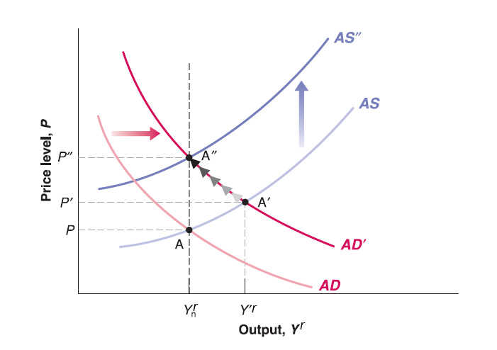

## Philips Curve

Recall Aggregate Supply curve: $P=P^{e}\cdot (1+\mu)F(u, z)$, or substitute $u$ to be: $P\equiv P^{e}(1+\mu)F(1-\frac{Y^{r}}{L},z)$

  - When unemployment rate ($u$) falls below natural rate of unemployment ($u_{n}$), output ($Y'^{r}$) goes above the natural output level ($Y_{n}^{r}$),  the price level ($P'$) would be higher than expected price level ($P^{e}$).
  
  - When unemployment rate ($u$) exceeds natural rate of unemployment ($u_{n}$) output ($Y'^{r}$) goes below the natural output level ($Y_{n}^{r}$),  the price level ($P'$) would be lower than expected price level ($P^{e}$).

## Philips Curve

Here we can see some negative correlation between price and unemployment rate in short run is predicted by AS-AD model.

There is also some empirical evidence suggests the negative correlation between price (inflation) and unemployment rate. For simplicity, here we ignore the derivation to convert price into inflation but directly take a look at the empirical findings.

[What Is the Phillips Curve (and Why Has It Flattened)?](https://www.stlouisfed.org/open-vault/2020/january/what-is-phillips-curve-why-flattened)

In short, Phillips Curve is telling us:

  - Lower unemployment rate is associated with higher inflation.
  
  - Higher unemployment rate is associated with lower inflation.
  
## Philips Curve
  
Note that monetary policy controlled by central bank (Federal Reserve System), and monetary policy has short run effect on price (inflation), output and unemployment rate.

In other words, there has often been some trade-off between inflation and unemployment for policymakers in central bank.

  - Higher inflation with lower unemployment rate?
  
  - Lower inflation with higher unemployment rate?

## Philips Curve in History
  

## Philips Curve in 1960s and 1970s

In 1960s, Philips Curve seems still exist. [1960s](https://fred.stlouisfed.org/graph/?g=pV6M)

However, inflation and unemployment rate do not show any clear relationship in 1970s. [1970s](https://fred.stlouisfed.org/graph/?g=xar2)

  - Look at historical data for inflation and unemployment rate: [FRED](https://fred.stlouisfed.org/graph/?g=x8OZ)
  
  - Recall Price-wage Spiral in 1970s: [Price-Wage Spiral](https://kansaspublicradio.org/npr-news/think-inflation-bad-now-lets-take-step-back-1970s)
  
A decade of higher inflation induced by demand side fiscal expansion (AD curve shift to the right), short run negative relation between price (inflation) and unemployment rate was broken. High inflation fail to produce low unemployment rate.

  - Rational Expectation, Medium run AS-AD model became popular, eventually supply-side economics dominated 1980s' policy discussion. (Recall "from short run to medium run" adjustment).

## Okun's Law

Recall the definition of unemployment rate: $u=1-\frac{N}{L}=1-\frac{Y^{r}}{L}$.

Apparently by definition, the lower the unemployment rate, the higher the output (real GDP).

There is also some empirical evidence to support this relation. Here for simplicity, we still ignore the derivation to convert output level to real GDP growth.

[Okun's Law in 1970's](https://www.piie.com/blogs/realtime-economic-issues-watch/70s-show-has-recession-broken-okuns-law-and-why-did-white-house)