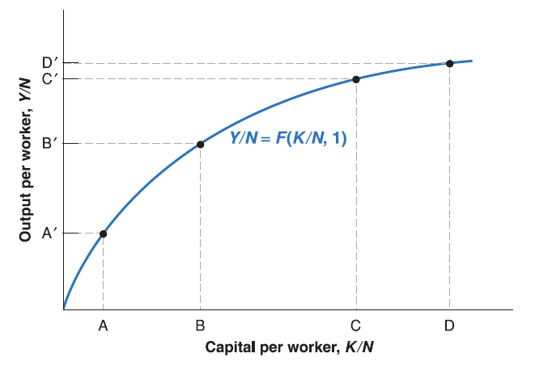
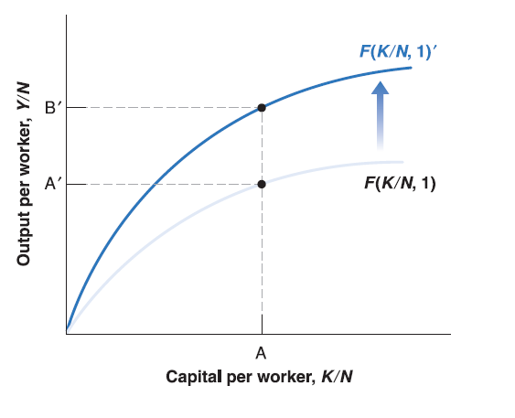
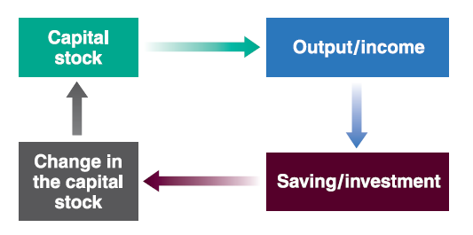

## Aggregate Production Function

In short run IS-LM model, we discuss the short run effects of demand side shocks (fiscal policy and monetary policy).

In medium run AS-AD model, we extend our analysis to supply side shocks (labor market condition and goods market competition).

There's still one place we haven't touch too much yet - the production function.

When we look back economic growth path for many countries, it's hard to say that long run economic growth is driven by some temporary demand or supply shocks. [1950-2017](https://ourworldindata.org/grapher/real-gdp-per-capita-pennwt?country=DEU~USA~CHN~IND~GTM~BRA~VEN~NGA~SGP~HKG~KOR)

Recall the simplified version of production function we introduced before: $Y^{r}=N$.

Now we extend our analysis to two inputs: capital $K$ and labor $N$:
$$
Y=F(K, N)
$$

  - Real Output $Y^{r}$ (for simplicity, we just write as $Y$ since there is no nominal variable in long run growth model) is a function $F(\cdot)$ of capital $K$ and labor $N$. The function $F(\cdot)$ determined by **state of technology**.

## Growth in Output per Worker

Returns to scale and returns to factors

  - **Constant returns to scale**: if the scale of operation is doubled - that is, if the quantities of capital and labor are doubled - then output will also double: $2Y=F(2K, 2N)$. Or more generally, for any number $x$: $xY=F(xK, xN)$.
  
  - **Decreasing returns to capital**: Given labor input unchanged, the increase in capital input will lead to smaller and smaller increases in output as the level of capital input increases.
  
  - **Decreasing returns to labor**: Given capital input unchanged, the increase in labor input will lead to smaller and smaller increases in output as the level of labor input increases.

By constant returns to scale $xY=F(xK, xN)$, let $x=\frac{1}{N}$, we have:
$$
\frac{Y}{N}=F(\frac{K}{N},\frac{N}{N})=F(\frac{K}{N}, 1)
$$

  - $\frac{Y}{N}$ is output per worker, $\frac{K}{N}$ is capital per worker.
  
  - Now we've convert capital into capital per worker $\frac{K}{N}$ and hold labor as constant $1$. Since we assume **decreasing return to capital**, the increase in capital per worker $\frac{K}{N}$ will lead to smaller and smaller increases in output as the level of capital per worker increases.

## The source of growth

  - Increases in output per worker $\frac{Y}{N}$ may come from increase in capital per worker $\frac{K}{N}$. This is so-called **capital accumulation**.
  
  - Increases in output per worker $\frac{Y}{N}$ may come from improvement of state of technology (e.g. $F(\cdot)$ to $F(\cdot)'$. This is so-called **technological progress**.

## The Effects of Capital on Output
  

To simplify notation, we'll rewrite the relation as:
$$
\frac{Y}{N}=f(\frac{K}{N})\equiv F(\frac{K}{N}, 1)
$$

## The Effects of Output on Capital Accumulation

In year $t$: 
$$\frac{Y_{t}}{N}=f(\frac{K_{t}}{N})$$

Recall in Lecture 4, we discussed composition of GDP (Y), and we get the **IS-relation** as below:

  - In equilibrium, investment always equal to saving: $I=S+(T-G)$. This is so called **IS relation**.
  
  - To make the long run model simple enough, let's ignore $(T-G)$ so that we have $I=S$.

  