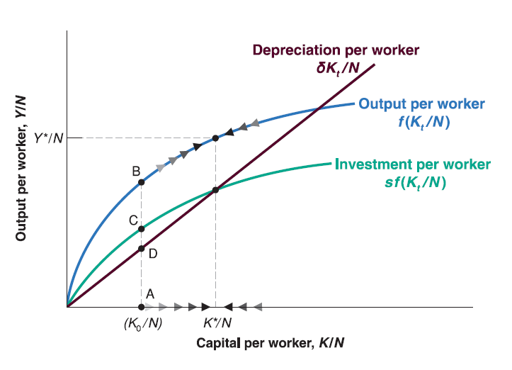
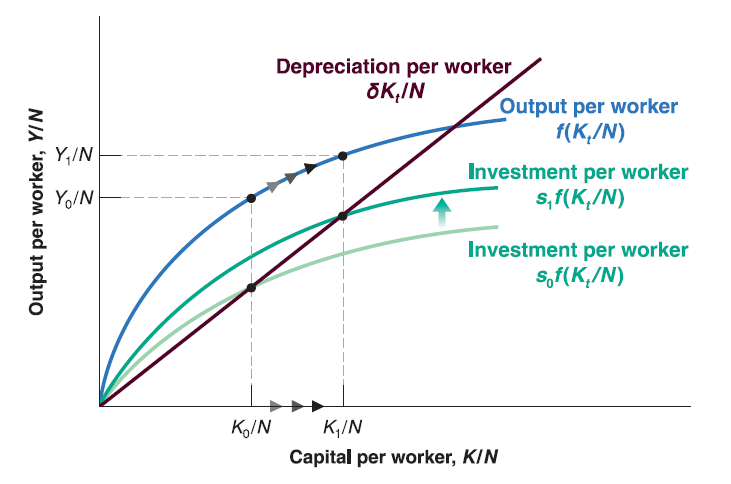
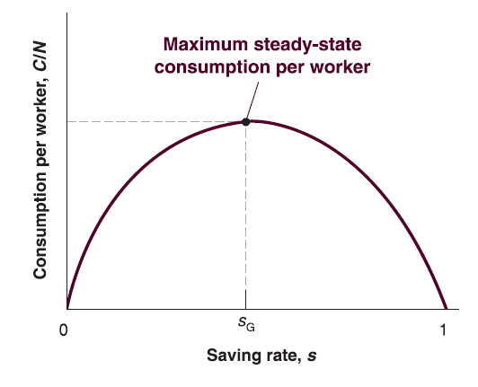

## Investment and Capital Accumulation
  
Assume that private saving is proportional to income: $S=s\cdot Y$

  - $s$ is saving rate ($0<s<1$).
  
Combine $I=S$ and $S=s\cdot Y$, in year $t$ we have: $I_{t}=s\cdot Y_{t}$.

Investment is proportional to output: higher output implies higher saving, then higher investment.

The evolution of capital stock is given by: $K_{t+1}=(1-\delta)K_{t}+I_{t}$.

Substitute $I_{t}$ by $I_{t}=s\cdot Y_{t}$ and divide both sides by $N$: $\frac{K_{t+1}}{N}=(1-\delta)\frac{K_{t}}{N}+s\frac{Y_{t}}{N}$.

Rearrange it: $\frac{K_{t+1}}{N}-\frac{K_{t}}{N}=s\frac{Y_{t}}{N}-\delta\frac{K_{t}}{N}$.

Plug $\frac{Y_{t}}{N}=f(\frac{K_{t}}{N})$ in: 
$$
\frac{K_{t+1}}{N}-\frac{K_{t}}{N}=s\cdot f(\frac{K_{t}}{N})-\delta\frac{K_{t}}{N}
$$

## Investment and Capital Accumulation

  - The left hand side $\frac{K_{t+1}}{N}-\frac{K_{t}}{N}$ is change in capital from year $t$ to year $t+1$.
  
  - The first term of right hand side $s\cdot f(\frac{K_{t}}{N})$ is investment during year $t$.
  
  - The second term of right hand side $\delta\frac{K_{t}}{N}$ is depreciation during year $t$.
  
So the change in capital from year $t$ to year $t+1$ equals to investment during year $t$ minus depreciation during year $t$.

The equation tells us:

  - If investment per worker exceeds depreciation per worker, the change in capital per worker is positive: capital per worker increases.
  
  - If investment per worker is less than depreciation per worker, the change in capital per worker is negative: capital per worker decreases.
  
## Investment and Capital Accumulation
  
  

## Steady-state Capital and Output

The state in which output per worker and capital per worker are no longer changing is called **steady state** of the economy.

Recall the evolution of capital per worker:
$$
\frac{K_{t+1}}{N}-\frac{K_{t}}{N}=s\cdot f(\frac{K_{t}}{N})-\delta\frac{K_{t}}{N}
$$

  - In steady state, no change in capital per worker, so that the left hand side $\frac{K_{t+1}}{N}-\frac{K_{t}}{N}=0$. Thus the investment should be equal to depreciation since right hand side $s\cdot f(\frac{K_{t}}{N})-\delta\frac{K_{t}}{N}$ has to equal to zero.
  
If we denote the steady-state capital per worker as $\frac{K^*}{N}$, then:
$$
s\cdot f(\frac{K^*}{N})=\delta\frac{K^*}{N}
$$

Given steady-state capital per worker, $\frac{K^*}{N}$, we can denote steady-state output per worker as $\frac{Y*}{N}$, so that:
$$
\frac{Y^*}{N}=f(\frac{K^*}{N})
$$

## The Saving Rate and Output

How does saving rate affect growth rate of output per worker?

  - Saving rate has no effect on long run growth rate of output per worker, which is equal to zero.
  
  - Saving rate determines the level of output per worker in long run.
  
## The Saving Rate and Output
  
Since increase in saving rate can increase long run steady-state output per worker, why not save all?

  - The goal for economic growth is to increase consumption, not investment. Although saving (investment) can boost future output per worker so that boost future consumption, you will die before you see future consumption if you save all...
  
  - In steady state, saving (investment) always equal to depreciation. If saving rate is too high, the proportion of consumption is very low...
  

## Economic Growth in Real World

Foreign Aid vs. Saving ?

  - [Kamala Harris tells Guatemala migrants: 'Do not come to US'](https://www.bbc.com/news/world-us-canada-57387350)

  - [$157m ($9.46 per capita) US aid to Guatemala in 2019](https://explorer.usaid.gov/cd/GTM?fiscal_year=2019&measure=Obligations)
  
  - [$793m ($4 per capita) US aid to Nigeria in 2019](https://explorer.usaid.gov/cd/IND?fiscal_year=2019&measure=Obligations)

  - [$29m ($0.02 per capita) US aid to China in 2019](https://explorer.usaid.gov/cd/CHN?fiscal_year=2019&measure=Obligations)
  
  - [$97m ($0.07 per capita) US aid to India in 2019](https://explorer.usaid.gov/cd/IND?fiscal_year=2019&measure=Obligations)
  
  - [Real GDP per capita for 4 countries](https://ourworldindata.org/grapher/real-gdp-per-capita-pennwt?country=CHN~IND~GTM~NGA)
  
  - [Gross saving rate by country](https://en.wikipedia.org/wiki/Gross_national_savings_by_country)
  
**Saving matters!**

More reasons...

[Money alone can’t fix Central America – or stop migration to US](https://theconversation.com/money-alone-cant-fix-central-america-or-stop-migration-to-us-157953)

[More Information Contact Amazing Student (Alumni) of Dept. of Economics](https://liberalarts.tamu.edu/economics/2021/07/15/edwin-felipe-morales-cal-july-2021/)

  