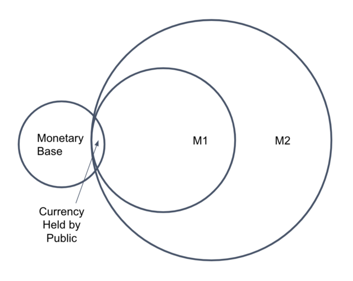
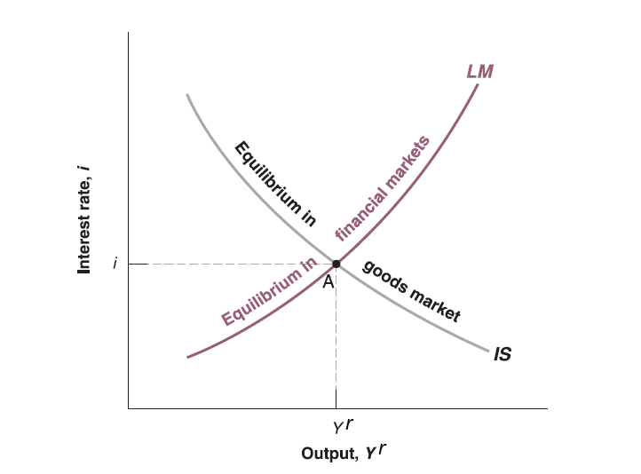

## The demand for money

Since money demand ($M^{d}$) (e.g. proportion of money vs. bonds) depends on transactions and interest rate ($i$), level of transactions depends on aggregate price level ($P$) and goods and services on the market (real GDP $Y^{r}$). It can be written as:
$$
M^{d}=P\cdot Y^{r}\cdot \underset{(-)}{L(i)}
$$

  - The higher the aggregate price level $P$, the higher the demand for money $M^{d}$.
  
  - The higher the real GDP $Y^{r}$, the higher the demand for money $M^{d}$.
  
  - The negative sign means $L(\cdot)$ is some decreasing function. The higher the interest rate $i$, the lower the money demand $M^{d}$, since you prefer to hold bonds to earn more interest rather than hold money when interest rate is high.
  
Alternatively you can rearrange it:
$$
\frac{M^{d}}{P}=Y^{r}\cdot \underset{(-)}{L(i)}
$$
  - Real money demand $\frac{M^{d}}{P}$ is positive correlated with real GDP $Y^{r}$ but negative correlated with interest rate $i$.
  
## The supply for money

This model assume central bank controls money supply, so money supply $M$ is given (exogenous) by monetary policy. 

By Federal reserve system's definition, there are several standard measures of the money supply, including the monetary base, M1, and M2. [US money supply](https://www.federalreserve.gov/faqs/money_12845.htm)

## Equilibrium

In equilibrium, money demand always equal to money supply. Therefore, $M^{d}=M$.

Substitute $M^{d}$ by $M$ in money demand equation:

$$
\frac{M}{P}=Y^{r}\cdot \underset{(-)}{L(i)}
$$
  - In equilibrium, real money supply ($\frac{M}{P}$) is equal to real GDP ($Y^{r}$) times some decreasing function of interest rate ($L(i)$).
  
  - Given price level ($P$) and money supply ($M$), so that real money supply ($\frac{M}{P}$) is given. You need higher interest rate to offset the increase on money demand driven by higher real GDP ($Y^{r}$).
  
  - Intuitively, higher real GDP ($Y^{r}$) means more goods and services on the market for transactions, which leads to higher money demand. However, real money supply ($\frac{M}{P}$) is given, consumers are selling bonds for money. Bond issuers have to offer higher interest rate ($i$) to attract buyers.
  
  - Alternatively, higher real GDP ($Y^{r}$) means higher income, which leads to more consumption (transactions). However, real money supply ($\frac{M}{P}$) is given, consumers are selling bonds for money. Bond issuers have to offer higher interest rate ($i$) to attract buyers.
  
## IS relation and LM relation

In summary, the equilibrium condition for financial market:

  - Money demand (Liquidity demand) == Money Supply
  
  - This is so called **LM relation**.

Now recall **IS relation** in goods market, we can summarize as below:

  - IS relation: $Y^{r} = c_{0}+c_{1}(Y^{r}-T)+\overline{I}+G$ (take investment as given, zero trade balance)
  
  - LM relation: $\frac{M}{P}=Y^{r}\cdot L(i)$

Now the goal for economists is to connect IS and LM relation as a function system to explain macroeconomy.

  - Real GDP ($Y^{r}$) has already appeared in both functions (endogenous variable). 
  
  - Now endogenize investment ($\overline{I}$) as a function of interest rate ($i$): $\underset{(-)}{I(i)}$.

## IS relation and LM relation

Intuitively, Firms' investment are restricted by borrowing cost (borrowing money from bank is similar to issuing corporate bonds to investor in economic sense).

Now IS relation becomes:

$$
Y^{r} = c_{0}+c_{1}(Y^{r}-T)+\underset{(-)}{I(i)}+G
$$
Together with LM relation:

$$
\begin{cases}
Y^{r} = c_{0}+c_{1}(Y^{r}-T)+I(i)+G\\
\frac{M}{P}=Y^{r}\cdot L(i)
\end{cases}
$$

  - Two equations with two unknown (endogenous variables): $Y^{r}$ and $i$.
  
  - A perfect equation system you know it's solvable! [Solver by Wolfram](https://www.wolframalpha.com/widgets/view.jsp?id=b42a80c01d9b3bb5bb385d4fba81a0c5)
  
## IS relation and LM relation

Rearrange IS equation:

$$
\begin{cases}
(1 - c_{1})Y^{r} - c_{0} + c_{1}\cdot T - G = I(i)\\
\frac{M}{P}=Y^{r}\cdot L(i)
\end{cases}
$$

  - Since $c_{1}$ is marginal propensity to consume, which should be between 0 and 1 (you only consume part of your disposable income according to consumption equation $C=c_{0}+c_{1}\cdot Y_{D}$). Therefore $(1 - c_{1})$ should be positive.

  - To hold the IS equality, when interest rate ($i$) goes down, investment ($I(i)$) goes up, real GDP ($Y^{r}$) will go up.
  
  - The intuition is lower interest rate ($i$) will lower borrowing cost for investment ($I(i)$), so firms invest more (on machine and buildings et.al) which leads to higher production (real GDP $Y_{r}$).
  
In summary, take other variables as given (exogenous):

  - the decrease of interest rate $i$ leads to increase of output ($Y_{r}$) in **IS relation**. (Negative correlation)
  
  - the increase of output ($Y_{r}$) leads to higher interest rate $i$ in **LM relation**. (Positive correlation)
  
The solution of this equation system is unique!

## IS-LM Curve
  

