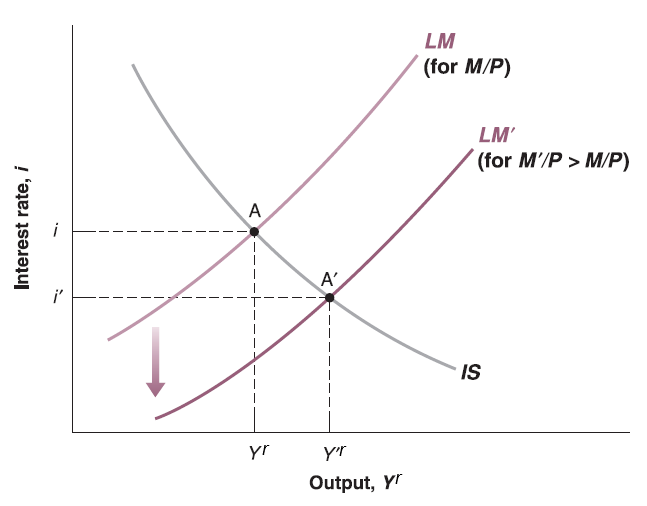

## Exogenous and Endogenous variables in IS-LM Model

Recall the IS-LM Model:

$$
\begin{cases}
Y^{r} = c_{0}+c_{1}(Y^{r}-T)+I(i)+G\\
\frac{M}{P}=Y^{r}\cdot L(i)
\end{cases}
$$

There are only two variables are endogenous (determined by the model itself): real GDP ($Y^{r}$) and interest rate ($i$)

Other variables are given (exogenous, determined outside of the model): 

  - Autonomous consumption ($c_{0}$) and marginal propensity to consume ($c_{1}$) depend on consumer's preference.
  
  - Net taxes ($T$) and government expenditure ($G$) depend on government's fiscal policy. [Budget of U.S. Government](https://www.usa.gov/budget)
  
  - The detail structure of investment function ($I(\cdot)$) depend on firm's decision and productivity, although we know it should be a decreasing function of interest rate ($i$).
  
  - Money supply ($M$) depends on government's monetary policy [FOMC](https://www.federalreserve.gov/monetarypolicy/fomc.htm)
  
  - This model assume aggregate price level ($P$) is given and unchanged in the short run.
  
  - The detail structure of $L(\cdot)$ depends on consumer's liquidity preference, although we know it should be a decreasing function of interest rate ($i$).

## Relation between Endogenous Variables in IS-LM Model

As we discussed before, IS-LM model is two equation, two unknown (endogenous variables) system.

  - Take all exogenous variables ($c_{0}$, $c_{1}$, $T$, $G$, $M$, $P$), investment function ($I(\cdot)$) and liquidity function ($L(\cdot)$) as given.

  - Two unknowns (endogenous variables) $Y^{r}$ and $i$ can be put on horizontal and vertical axis. 
  
  - Two functions can be drawn as two lines on the graph. The relation between two unknown endogenous variables ($Y^{r}$, $i$) can be represented by the points on those two lines. 
  
  - The cross point of two lines is just the solution of this equation system which meet the equilibrium condition for both equations (markets) simultaneously.
  
  - If we are going to change the value of exogenous variables ($c_{0}$, $c_{1}$, $T$, $G$, $M$, $P$), then the corresponding line will shift to reflect new equilibrium on that market. New general equilibrium would be on the new cross point.
  
## Fiscal Policy on IS Curve

Assume government increase net taxes $T$ (increase taxes or cut transfer payments), we see $T$ only appears on IS relation: $Y^{r} = c_{0}+c_{1}(Y^{r}-T)+I(i)+G$

Rearrange it: $(1 - c_{1})Y^{r} = c_{0}-c_{1}T+I(i)+G$

Apparently, for any interest rate $i$, increase in $T$ will decrease the right hand side of equation since $c_{1}>0$. To hold the equality, left hand side should go down. Since $1 - c_{1} > 0$, $Y^{r}$ will go down. So that IS curve will shift to the left.

## Fiscal Policy on IS-LM Curve

Now put the LM curve on, we can see the new cross point as new general equilibrium. The new equilibrium has lower interest rate ($i$) and lower output ($Y^{r}$).

The intuition starts from goods market (IS relation):

  - The increase of net taxes $T$ leads to the decrease of consumer's disposable income $Y_{D}^{r}=Y^{r} - T$.
  
  - Lower disposable income $Y_{D}^{r}=Y^{r} - T$ reduces induced consumption $c_{1}\cdot Y_{D}=c_{1}(Y^{r} - T)$ and then consumption $C$.
  
  - Eventually production (real GDP $Y^{r}$) decreases due to lack of consumption demand.
  
## Fiscal Policy on IS-LM Curve

Then goes to financial market (LM relation):

  - Lower income (real GDP $Y^{r}$) and lower consumption ($C$) lead to lower transaction need.
  
  - However, real money supply ($\frac{M}{P}$) is given, consumers use extra money to buy more bonds to earn interest. Bond issuers can offer lower interest rate ($i$) since buyers compete with each other.
  
In summary, net taxes ($T$) goes up, output (real GDP $Y^{r}$) and interest rate ($i$) goes down.

Also, disposable income ($Y_{D}^{r}$) and consumption ($C$) go down.

Question: government can choose government spending $G$ through budget legislation process. What do you think about the effect of $G$ on output ($Y^{r}$), interest rate ($i$), disposable income ($Y_{D}^{r}$) and consumption ($C$)? [Midterm Project](projects.html)

## Monetary Policy on LM Curve

Assume federal reserve system increase money supply $M$, we see $M$ only appears on LM relation: $\frac{M}{P}=Y^{r}\cdot L(i)$

For any output $Y^{r}$, increase in $M$ will increase the left hand side of equation since aggregate price level $P$ is assumed to be unchanged in short run. To hold the equality, left hand side should go up. Since $L(\cdot)$ is some decreasing function, $i$ should go down. So that LM curve will shift down.

## Monetary Policy on IS-LM Curve

Now put the IS curve on, we can see the new cross point as new general equilibrium. The new equilibrium has lower interest rate ($i$) and higher output ($Y^{r}$).

## Monetary Policy on IS-LM Curve

The intuition starts from financial market (LM relation):

  - The increase of money supply $M$ leads to the increase of real money supply $\frac{M}{P}$.
  
  - Higher real money supply ($\frac{M}{P}$) means consumers have more extra money to buy more bonds to earn interest. Bond issuers can offer lower interest rate ($i$) since buyers compete with each other.
  
Then goes to goods market (IS relation):

  - Lower interest rate ($i$) leads to higher investment ($I(i)$) since investment function is decreasing function.
  
  - Higher investment ($I(i)$) leads to more production (real GDP $Y^{r}$) and more demand on capital goods.
  
  - More production (real GDP $Y^{r}$) leads to more income (e.g. wage, dividend), then higher disposable income $Y_{D}^{r}=Y^{r} - T$.
  
  - Higher disposable income $Y_{D}^{r}=Y^{r} - T$ increases induced consumption $c_{1}\cdot Y_{D}=c_{1}(Y^{r} - T)$ and then consumption demand $C$ as well.
  
In summary, money supply ($M$) goes up, interest rate ($i$) goes down but output (real GDP $Y^{r}$) goes up.

Also, investment ($I(i)$), disposable income ($Y_{D}^{r}$) and consumption ($C$) goes up.
