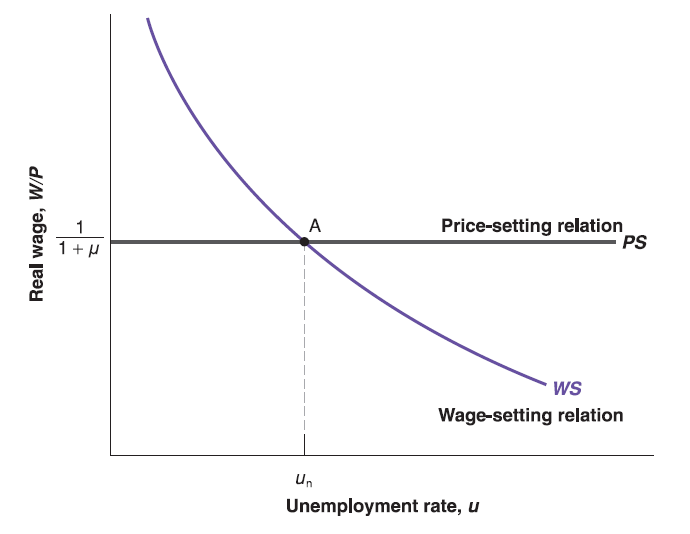

## Wages Determination

We capture our discussion of wage determination by using the following equation: $W=P\cdot F\underset{(-, +)}{(u, z)}$.

Alternative, we can rearrange the wage determination equation to see real wage: $\frac{W}{P}=F\underset{(-, +)}{(u, z)}$.

The aggregate nominal wage $W$ depends on three factors:

  - The price level $P$.
  
    - Neither firms nor Workers care about nominal wages $W$, they care about real wage $\frac{W}{P}$.

  - The unemployment rate, $u$.
  
    - The higher the unemployment rate $u$, the lower the real wage $\frac{W}{P}$.
  
  - A catchall variable, $z$, that stands for all other variables that may affect the outcome of wage setting.
  
    - Unemployment benefit [One more year?](https://www.cnbc.com/2021/07/16/delta-variant-may-fuel-push-to-extend-unemployment-pay-experts-say.html)
    
    - [Minimum wage](https://www.dol.gov/agencies/whd/minimum-wage/state#footnote) 

    - [AI Robots Replacement](https://abc7ny.com/covid-covid-19-hollywood-florida-restaurant/10556362/) [Drone Replacement](https://www.youtube.com/watch?v=44KvHwRHb3A)

## Price Determination

The prices set by firms depend on the costs they face ([Economic Profit](https://en.wikipedia.org/wiki/Profit_(economics))). These costs depend on the nature of the **production function**:
$$
Y=A\cdot N
$$
where $Y$ is output, $N$ is employment and $A$ is labor productivity. In this simplied production function, we ignore capital (e.g. machines and factories) for a while. We also ignore technological progress and assume $A$ is constant.

Assume $A=1$, we have $Y=N$. This is equivalent to assume one unit of labor produces one unit of goods.

Since labor cost per unit is wage $W$, sales revenue per unit is price $P$ (In microeconomics: marginal cost of production - the cost of producing one more unit of output - is equal to $W$).

  - Perfect competition on goods market: $P=W$ (marginal revenue equals to marginal cost).
  
  - General case: $P=(1+\mu)W$ (marginal revenue equals to marginal cost ($\mu=0$, e.g. perfect competition) greater than marginal cost ($\mu>0$, e.g. market power)).
  
    - where $\mu$ is the **mark-up** of the price over the cost. It captures economic profit for firms. The higher the degree of competition (the lower the market power of firms), the lower the **mark-up**. The lower the degree of competition (the higher the market power of firms), the higher the **mark-up**.

Alternatively, we can rearrange price determination equation to see real price: $\frac{P}{W}=1+\mu$.

## Labor Market Equilibrium

Take catchall variable $z$ and mark-up $\mu$ as given (exogenous), this is a two-equation system with two unknown (endogenous) variables: real wage ($\frac{W}{P}$) (if we treat it as one variable here) and unemployment rate ($u$). Labor market equilibrium is determined by:

$$
\begin{cases}
\frac{W}{P}=F(u, z)           & \text{wage-setting relation}  \\
\frac{W}{P}=\frac{1}{1+\mu}   & \text{price-setting relation}
\end{cases}
$$
The solution is obvious: 

  - The equilibrium level of real wage is uniquely determined by mark-up ($\mu$) through price-setting relation (e.g. $\frac{W}{P}\equiv\frac{1}{1+\mu}$) since $\mu$ is given.
  
  - Plug the equilibrium real wage ($\frac{W}{P}\equiv\frac{1}{1+\mu}$) into wage setting relation, we get $F(u, z)=\frac{1}{1+\mu}$. There exist an unique solution $u_{n}$ which satisfies the equation (e.g. $F(u_{n}, z)\equiv\frac{1}{1+\mu}$) since $\mu$ is given.
  
In summary, assume catchall variable $z$ is given, for any level of mark-up $\mu$, there is always an equilibrium real wage level $\frac{W}{P}\equiv\frac{1}{1+\mu}$ and equilibrium unemployment level $u_{n}$ on the labor market.

Similarly, we can draw this equation system as two curves (WS curve and PS curve) on a 2-dimensional graph since there are two unknown variables (real wage $\frac{W}{P}$ as vertical axis and unemployment rate $u$ as horizontal axis).

## Labor Market Equilibrium

Note that price-setting relation comes from firms' decision, it implies that: given the level of mark-up ($\mu$) by market competition, the highest real wage $\frac{W}{P}$ the firm is willing to pay is unrelated to unemployment rate $u$, but uniquely determined by mark-up $\mu$ as $\frac{W}{P}\equiv\frac{1}{1+\mu}$. (Flat curve)

The wage-setting relation comes from workers' decision, the higher the unemployment rate $u$, the lower the real wage $\frac{W}{P}$ they have to accept (e.g. outside choice).
  

